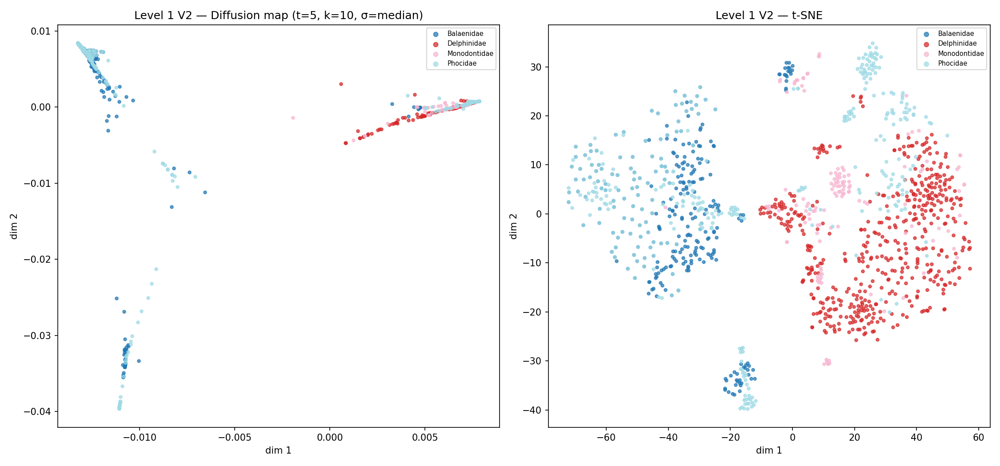

# Spectral Graph Methods for Marine Mammal Vocalization Classification

A Python research project that applies spectral graph learning to marine mammal
recordings from the Watkins Marine Mammal Sound Database. It implements family
classification, dolphin-species classification, and acoustic clustering, alongside
ResNet-18 and autoencoder baselines.

Developed for **MATH 5466 — Mathematics of Machine Learning and Data Analysis II**,
University of Minnesota, Spring 2026.

[Project report](docs/report/project_report.pdf) · [Methods and evaluation](docs/METHODS.md) · [Dataset details](docs/DATA.md)

## What the project does

The pipeline turns audio recordings into two-second windows, extracts acoustic
features and mel spectrograms, constructs weighted nearest-neighbor graphs, and
uses graph Laplacians to classify sounds and explore their structure.

| Analysis | Task | Dataset used |
| --- | --- | --- |
| **Level 1** | Semi-supervised classification of four marine mammal families | 529 clips, 1,291 windows |
| **Level 2** | Semi-supervised classification of 17 Delphinidae species | 1,068 clips, 2,793 windows |
| **Level 3** | Unsupervised exploration of Spinner Dolphin vocalizations | 114 clips, 122 windows after per-clip capping |

The full source inventory contains **1,697 recordings across 32 species and seven
families**. Each analysis selects a subset appropriate to its task.

## Completed work

- **Dataset preparation:** downloaded and catalogued recordings, mapped species
  to genus and family, and analyzed class distributions and audio properties.
- **Audio preprocessing:** resampled to 22,050 Hz, applied bandpass filtering,
  segmented recordings, and generated acoustic feature vectors and log-mel
  spectrograms.
- **Graph learning:** implemented weighted k-nearest-neighbor graphs, graph
  Laplacians, harmonic label propagation, Laplacian regularization, diffusion-map
  embeddings, and spectral clustering.
- **Classification experiments:** evaluated family and species prediction with
  repeated clip-level label selections, graph-parameter sweeps, connectivity
  correction, and a Level 2 feature ablation.
- **Neural baselines:** trained ResNet-18 classifiers and an autoencoder-based
  clustering baseline, with saved training curves and evaluation outputs.
- **Acoustic analysis:** examined Spinner Dolphin clusters through spectral
  diagnostics, acoustic proxy comparisons, and sampled spectrogram grids.
- **Research artifacts:** produced a course report, experiment notebooks, result
  JSON files, confusion matrices, embedding plots, and per-run result folders.

## Selected results

These are saved **V2 graph-learning results**. Classification accuracy is measured
on unlabeled windows in a transductive graph, with labels selected by recording.
Each classification summary averages 20 label splits.

| Experiment | Labeled clip fraction | Mean accuracy |
| --- | ---: | ---: |
| Family classification | 50% | **72.47% ± 4.86 percentage points** |
| Dolphin-species classification | 30% | **56.20% ± 11.45 percentage points** |
| Dolphin-species classification | 50% | **64.26% ± 11.99 percentage points** |
| Dolphin-species classification | 75% | **73.75% ± 8.55 percentage points** |

The species results use the original feature representation with a connected
`k=5` graph and self-tuning bandwidth. The saved feature-ablation experiments also
compare a representation based on MFCC and delta-MFCC variability.

For Spinner Dolphin clustering, the capped pool achieved its highest recorded
silhouette score of **0.1645 with two clusters**. Acoustic proxy comparisons and
spectrogram grids provide complementary ways to inspect the cluster structure.

The [methods document](docs/METHODS.md) explains the evaluation protocols used for
graph learning, CNN classification, and clustering. Detailed values are preserved
in the [Level 1 results](v2/Level1/level1_results_v2.json),
[Level 2 results](v2/Level2/level2_results_v2_fix5.json), and
[Level 3 results](v2/Level3/runs/run2/results/level3_results_v2_fix3.json).



*Diffusion-map and t-SNE projections of the Level 1 feature space, colored by family.*

## Repository structure

| Path | Contents |
| --- | --- |
| `01_download_and_explore.ipynb` | Dataset acquisition, inventory, and exploration |
| `02_preprocessing.ipynb` | Shared audio preprocessing and feature generation |
| `species_distribution.ipynb` | Species distribution visualization |
| `utils/` | Audio, feature, graph, evaluation, and CNN utilities |
| `v2/utils/` | Clip-level splitting, graph connectivity, alternative features, and run management |
| `v2/Level1/`, `v2/Level2/`, `v2/Level3/` | Revised experiment notebooks, figures, and results |
| `v2/resnet18_v2.ipynb` | ResNet-18 experiments for Levels 1 and 2 |
| `v2/embeddings_v2.ipynb` | Diffusion-map and t-SNE visualizations |
| `Level1/`, `Level2/`, `Level3/` | Original experiments and shared local data directories |
| `wmmd_metadata.csv` | Clip inventory with taxonomy and source split |
| `docs/report/` | Course report in PDF and editable Word formats |
| `tests/`, `.github/workflows/` | Numerical helper tests and automated validation |

## Installation

Use Python 3.11 for a new environment:

```bash
python -m venv .venv
# Windows PowerShell: .\.venv\Scripts\Activate.ps1
# macOS/Linux: source .venv/bin/activate
python -m pip install -r requirements.txt
python -m jupyter lab
```

Select the notebook kernel associated with this environment. The notebooks support
CPU execution and use a compatible CUDA GPU when available. Allow several gigabytes
of disk space for downloaded audio and generated arrays.

## Run the pipeline

Execute cells in order, using a fresh kernel for each notebook:

1. **Download and explore:** `01_download_and_explore.ipynb` caches the pinned
   dataset revision in `Mss/data/wmms_parquet_local/` and generates the metadata CSV.
2. **Preprocess:** `02_preprocessing.ipynb` creates the shared features and
   spectrograms under `Level*/Data/`.
3. **Generate revised features:** `v2/02_preprocessing_v2.ipynb` prepares the
   alternative Level 2 feature set.
4. **Run graph classification:** execute `v2/Level1/level1_classification_v2.ipynb`
   and `v2/Level2/level2_classification_v2.ipynb`.
5. **Run CNN classification:** `v2/resnet18_v2.ipynb` uses the saved label masks
   from the preceding graph notebooks.
6. **Run acoustic clustering:** `v2/Level3/level3_clustering_v2.ipynb` generates
   cluster assignments and acoustic proxy diagnostics.
7. **Generate additional figures:** run `v2/embeddings_v2.ipynb`,
   `species_distribution.ipynb`, or `python v2/Level3/make_cluster_spectrograms.py`.

V2 notebooks save figures and metrics in `runs/runN/` folders. Audio, feature
arrays, and model checkpoints are stored locally; the repository includes curated
figures and JSON results. The preserved Level 3 `run2` records an extended
`k=2..39` sweep, while the notebook's standard sweep is `k=2..8`.

## Tests

```bash
python -m pip install -r requirements-test.txt
python scripts/validate_repository.py
python -m pytest -q
```

The test suite covers graph numerics, clip-level splitting, connectivity repair,
and run management. Static checks validate notebook structure and code syntax.

## Data attribution and license

The recordings come from [confit/wmms-parquet](https://huggingface.co/datasets/confit/wmms-parquet).
Credit: **Watkins Marine Mammal Sound Database, Woods Hole Oceanographic Institution
and the New Bedford Whaling Museum**. The dataset card describes personal or academic,
noncommercial use; see [data provenance](docs/DATA.md).

Original project code is released under the [MIT license](LICENSE). Recordings and
associated source metadata retain their separate upstream terms.
